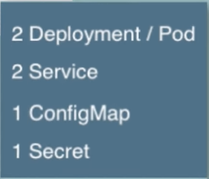
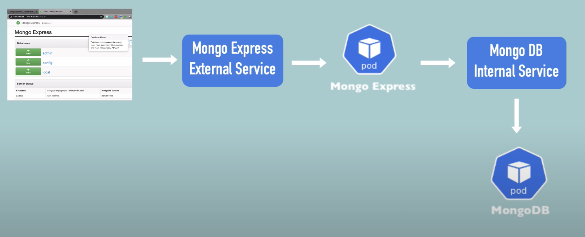

# K8s Complete Application Deployment
In this example we are deploying an Mongo express app and its database. So K8s componets that we will be using are :



- Deployment/Pods (of course )
- Service (for permanent IP address of pods)
    - Internal (for DB )
    - External (for app)
- Secret (for storing login credentials)
- ConfigMap (for application configration)
## Browser Request Flow through the K8s Components


## Creating YAML files
### Step 1 : Mongo DB Deployment (database)
note: k8s cluster should be running
- Creating `Deployment` file for MongoDB `fileName:mongodbDeploy.yaml`
    - requirements :
        - ENV variables :
            - `MONGO_INITDB_ROOT_USERNAME`
            - `MONGO_INITDB_ROOT_PASSWORD` 
- Create `Secret` file for storing login credentials `fileName:mongodbSecret.yaml`
    - requirements :
        - Username & Password in base64 encoded
- NOTE: You need to deploy secret before Deployment file, because we are referencing it in deployment
- Deploying `Secret` file
    - To deploy the CLI commands is
        ```
        kubectl apply -f mongodbSecret.yaml
        ```
    - To see the list of Secret in your machine
        ```
        kubectl get secret
        ```
- Now we can refrence it in our application deployment file    
- Deploying `mongodbDeploy.yaml` file
    - To deploy the CLI commands is
        ```
        kubectl apply -f mongodbDeploy.yaml
        ```
    - To see the list of Pod in your machine
        ```
        kubectl get pod
        ```
    - To see the describe of sepecific pod
        ```
        kubectl describe pod <nameOfPod>
        ```
